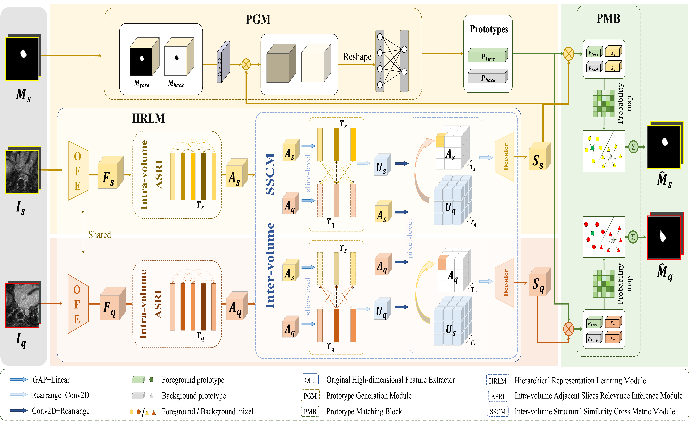

## Hierarchical Relational Inference for Few-Shot Learning in 3D Left Atrial Segmentation

<p align="middle">
    
</p>

## Prepare Datasets
CHAOS - Combined (CT-MR) Healthy Abdominal Organ Segmentation
```
https://chaos.grand-challenge.org/Download/
```

2018 Atria Segmentation Challenge Data
```
https://www.cardiacatlas.org/atriaseg2018-challenge/atria-seg-data/
```
The Multi-modality Whole Heart Segmentation (MM-WHS) 2017 dataset
```
https://zmiclab.github.io/zxh/0/mmwhs/
```

## Requirements
- Python 3.8
- PyTorch 1.8.0
- cuda 11.1
